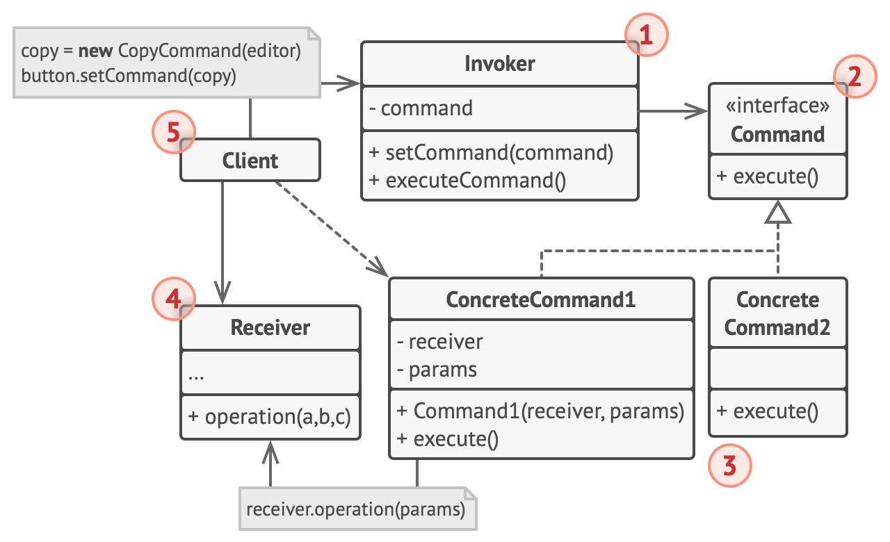
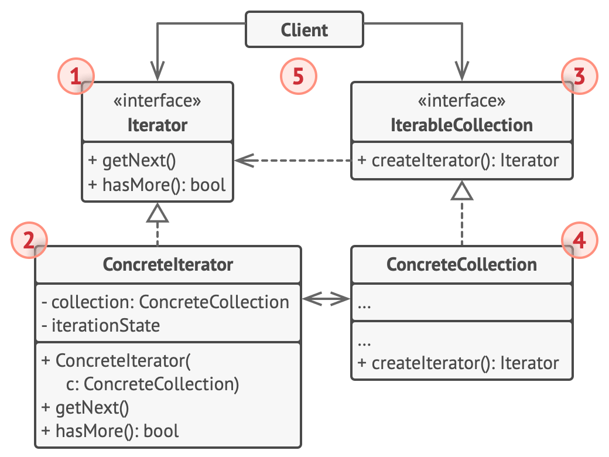
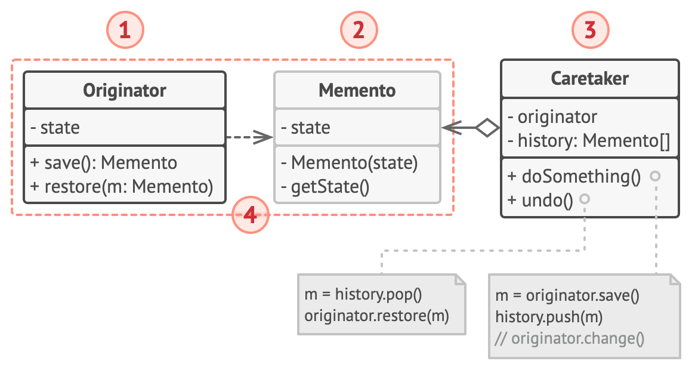
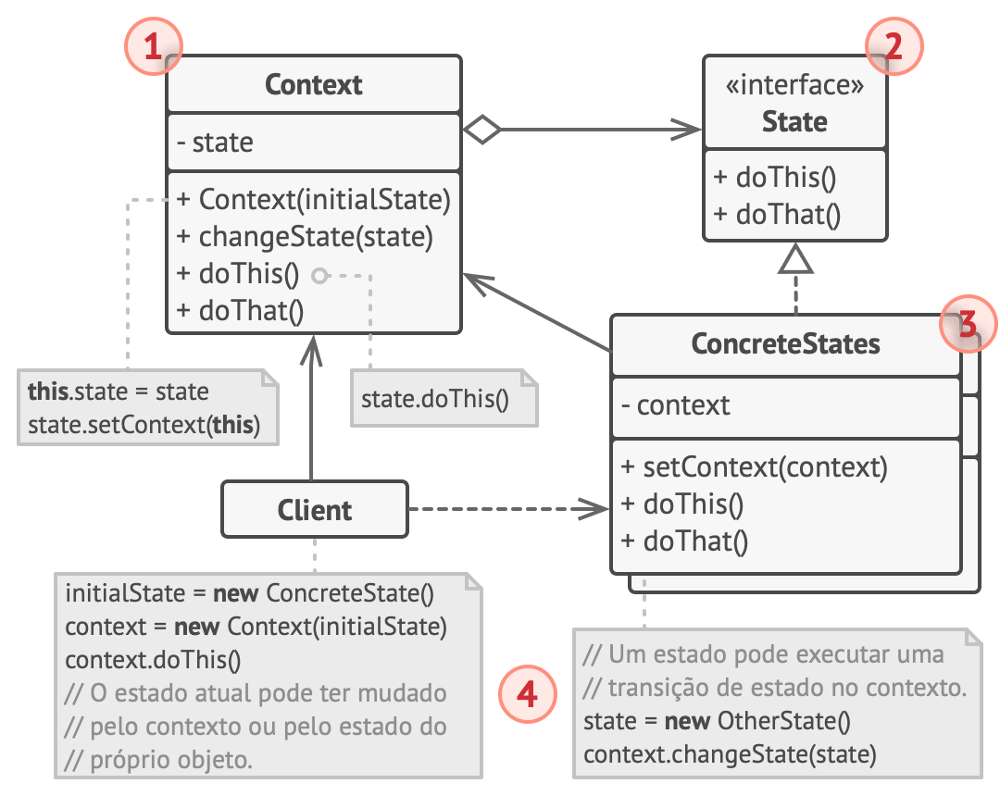
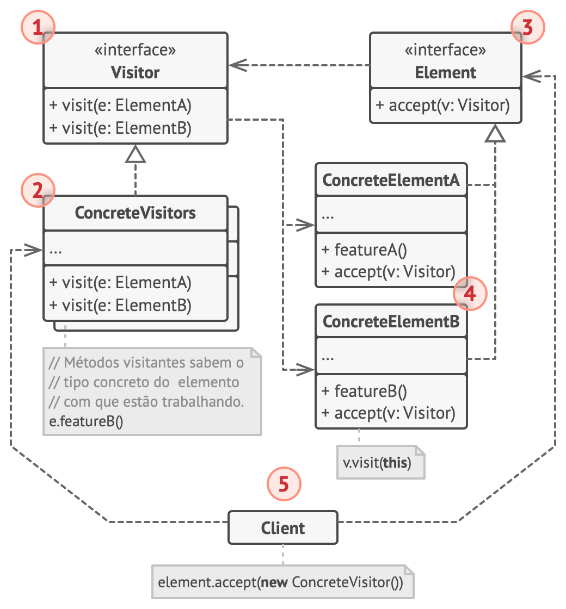

# Comportamentais
Os padrões de design comportamentais são focados nos padrões de interação entre objetos e a distribuição de responsabilidades. Aqui está um breve resumo dos principais padrões de design comportamentais:

## Chain of Responsibility (Corrente de Responsabilidade):

**Propósito:** Permite que vários objetos manipulem uma solicitação sem o remetente precisar conhecer qual objeto a está tratando.

**Uso Típico:** Quando é necessário passar solicitações através de uma cadeia de manipuladores, e o sistema precisa ser flexível e desacoplado.

## Command (Comando):

**Propósito:** Encapsula uma solicitação como um objeto, permitindo parametrizar clientes com diferentes solicitações, enfileirar solicitações e suportar operações reversíveis.

**Uso Típico:** Para desacoplar remetentes e destinatários de uma solicitação, ou quando se deseja suportar operações que podem ser desfeitas.

## Iterator (Iterador):

**Propósito:** Fornece uma maneira uniforme de acessar os elementos de uma coleção sem expor a representação interna da coleção.

**Uso Típico:** Para percorrer elementos de uma coleção sem expor a estrutura interna da coleção.

## Mediator (Mediador):

**Propósito:** Define um objeto que centraliza a comunicação entre objetos em um sistema, promovendo o baixo acoplamento.

**Uso Típico:** Quando muitos objetos precisam se comunicar entre si, mas desejamos evitar dependências diretas, ou quando a lógica de comunicação se torna complexa.

## Memento (Memento):

**Propósito:** Captura e externaliza o estado interno de um objeto, permitindo que o objeto seja restaurado para esse estado mais tarde.

**Uso Típico:** Quando é necessário criar pontos de restauração em um objeto, como em sistemas de edição ou em casos de desfazer/refazer.

## Observer (Observador):

**Propósito:** Define uma dependência um para muitos entre objetos, de modo que, quando um objeto muda de estado, todos os seus dependentes são notificados e atualizados automaticamente.

**Uso Típico:** Quando um objeto precisa notificar outros objetos sobre mudanças em seu estado, como em sistemas de eventos.

## State (Estado):

**Propósito:** Permite que um objeto altere seu comportamento quando seu estado interno muda, parecendo mudar a classe do objeto.

**Uso Típico:** Para representar estados de um objeto e controlar sua transição de maneira flexível, especialmente quando há muitos estados e transições.

## Strategy (Estratégia):

**Propósito:** Define uma família de algoritmos, encapsula cada um deles e os torna intercambiáveis.

**Uso Típico:** Quando é necessário suportar vários algoritmos ou estratégias e deseja-se que o cliente possa escolher entre eles dinamicamente.

## Visitor (Visitante):

**Propósito:** Representa uma operação a ser executada nos elementos de uma estrutura de objetos. Permite definir novas operações sem alterar as classes dos elementos.

**Uso Típico:** Quando se deseja realizar operações em uma estrutura de objetos sem modificar as classes desses objetos, ou quando as operações não pertencem naturalmente às classes dos objetos.

