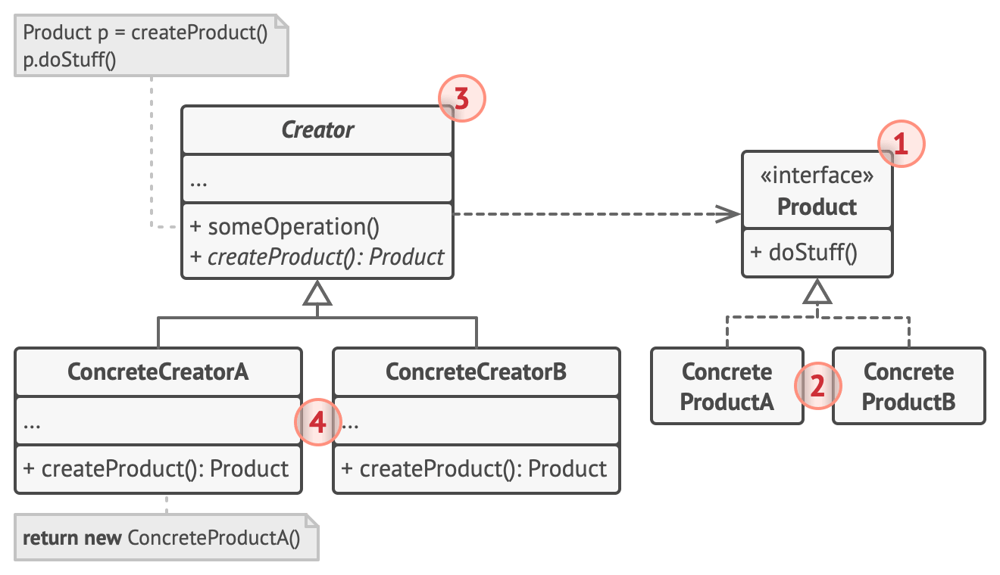

# Criacionais
Os padrões de design criacionais são utilizados para resolver problemas relacionados à criação de objetos em um sistema de software. Cada padrão aborda desafios específicos, proporcionando soluções flexíveis e eficientes para a criação de instâncias de classes.

## Singleton (Singleton):
**Propósito:** Garantir que uma classe tenha apenas uma instância e fornecer um ponto global de acesso a ela.

**Uso Típico:** Gerenciadores de configuração, conexões de banco de dados.

## Factory Method (Método de Fábrica):
**Propósito:** Definir uma interface para criar um objeto, mas deixar as subclasses alterarem o tipo de objetos que serão criados.

**Uso Típico:** Frameworks de GUI, como Swing em Java.

## Abstract Factory (Fábrica Abstrata):
**Propósito:** Fornecer uma interface para criar famílias de objetos relacionados ou dependentes sem especificar suas classes concretas.

**Uso Típico:** Criação de componentes UI em diferentes estilos (botões, caixas de texto) que devem ser consistentes entre si.

## Builder (Construtor):
**Propósito:** Separar a construção de um objeto complexo de sua representação, de modo que o mesmo processo de construção possa criar diferentes representações.

**Uso Típico:** Construção de objetos complexos, como documentos XML ou HTML.

## Prototype (Protótipo):
**Propósito:** Criar novos objetos copiando um protótipo existente, promovendo a reutilização de código e a criação eficiente de novas instâncias.

**Uso Típico:** Criação de clones de objetos, como na clonagem de células em um jogo.

## Object Pool (Pool de Objetos):
**Propósito:** Manter um conjunto de objetos prontos para uso, evitando o custo de criação e destruição de objetos frequentemente.

**Uso Típico:** Pools de conexões de banco de dados ou objetos pesados que são caros de criar.

