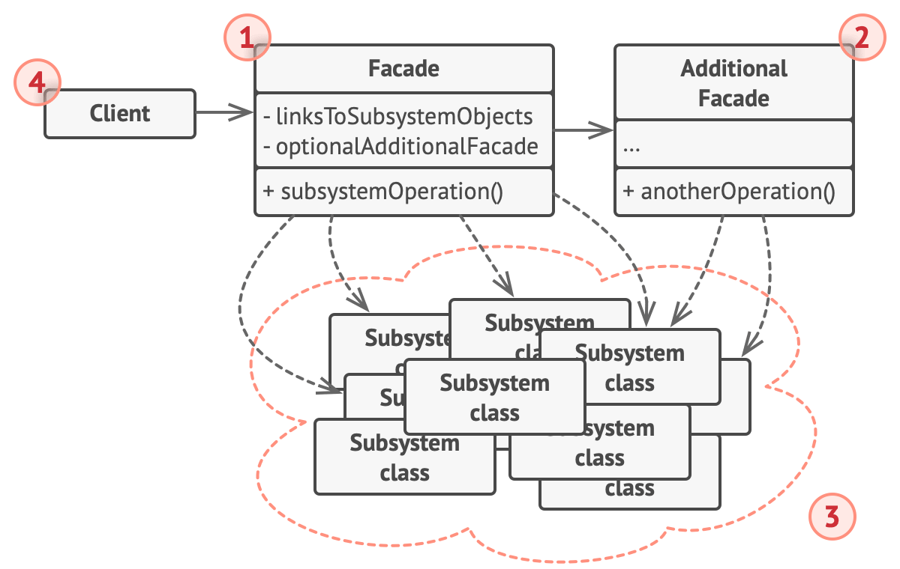

# Estruturais
Os padrões de design estruturais fornecem soluções para organizar e compor classes e objetos para formar estruturas maiores e mais complexas. Aqui está um breve resumo dos principais padrões de design estruturais:

## Adapter (Adaptador):

**Propósito:** Permite que interfaces incompatíveis trabalhem juntas.

**Uso Típico:** Quando uma classe precisa colaborar com classes ou interfaces incompatíveis, ou quando é necessário reaproveitar uma classe existente que não possui a interface desejada.

## Bridge (Ponte):

**Propósito:** Separa uma abstração de sua implementação, permitindo que ambas evoluam independentemente.

**Uso Típico:** Quando se deseja evitar um vínculo permanente entre uma abstração e sua implementação, ou quando há a necessidade de suportar diferentes implementações.

## Composite (Composto):

**Propósito:** Compor objetos em estruturas de árvore para representar hierarquias parte-todo.

**Uso Típico:** Quando é necessário tratar objetos individuais e composições de objetos de maneira uniforme, como na construção de árvores de componentes gráficos.

## Decorator (Decorador):
**Propósito:** Anexa responsabilidades adicionais a um objeto dinamicamente.

**Uso Típico:** Para estender o comportamento de classes de maneira flexível e modular, sem modificar seu código diretamente.

## Facade (Fachada):
**Propósito:** Fornece uma interface unificada para um conjunto de interfaces em um subsistema.

**Uso Típico:** Quando se deseja simplificar uma interface complexa ou ocultar a complexidade de um subsistema.

## Flyweight (Peso Leve):
**Propósito:** Permite o compartilhamento eficiente de múltiplas instâncias pequenas, reduzindo a redundância.

**Uso Típico:** Quando é necessário suportar um grande número de objetos idênticos, economizando recursos.

## Proxy (Procurador):
**Propósito:** Controla o acesso a um objeto, adicionando uma camada intermediária.

**Uso Típico:** Quando é necessário controlar o acesso a um objeto de maneira mais granular, como em lazy loading, controle de acesso ou logging.

